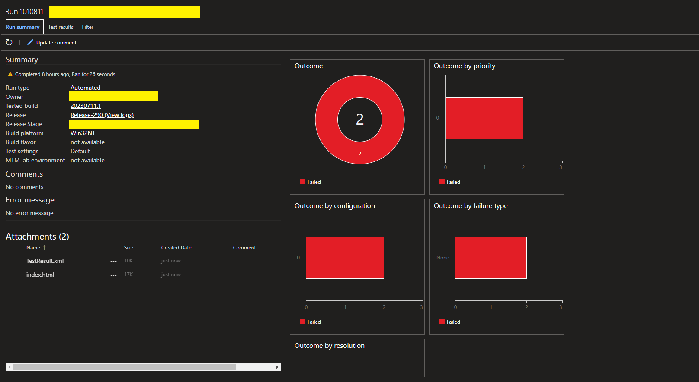

# TestSharp - C# Test Automation Framework

Test automation framework that utilizes Selenium to navigate through web-application and assert various web elements.

Includes following libraries:
- Selenium
- NUnit
- ExtentReports
- Newtonsoft.JSON
- FluentAssertions

## Installation

This is plug & play framework, no additional setup is required except for .NetFramework v4.8.1 dev pack.

## How to use it

1. Create new page class for the application being tested in **TestCases/Pages folder**. See example below:
```csharp

    public class LoginPage
    {

        // Create IWebDriver private field
        private IWebDriver driver;

        // Create a constructor to pass driver from the test
        public LoginPage(IWebDriver driver)
        {
            this.driver = driver;
        }

        // Find webelement on your login page using various locators (XPath, CSS, ID, Class etc.). Find more here https://www.selenium.dev/documentation/webdriver/elements/locators/
        private string userNameField = "//input[@id='username']";
        private string passWordField = "//input[@id='password']";
        private string loginButton = "//button[text()='Login']";


        // Create methods to interact with your webelement using pre-defined driver extensios in Source/WebDriver/DriverExtensions
        public void EnterUserName(string userName)
        {
            driver.SendKeys(By.XPath(userNameField), userName, hideValue:true);
        }

        public void EnterPassWord(string passWord)
        {
            driver.SendKeys(By.XPath(passWordField), passWord, hideValue:true);
        }

        public void ClickLoginButton()
        {
            driver.Click(By.XPath(loginButton));
        }

        // Create one concise method that will be called later in the test.
        public void Login(string userName, string password)
        {
            EnterUserName(userName);
            EnterPassWord(password);
            ClickLoginButton();
        }
    }
}
```

2. Create json file that will store test data. Example below:
```json
{
  "credentials" : {
    "username" : "TestUser",
    "password" : "MyPassword"
  }
}
```
Setup new or use existing **DataSetup.cs** class to retrieve values from json.
```csharp
    public class DataSetup
    {
        public string jsonPath;

        public DataSetup(string jsonPath)
        {
            this.jsonPath = jsonPath;
        }

        #region Credentials
        
        public string userName => (string)JsonManager.ReturnJsonObject(jsonPath)["credentials"]["userName"];
        public string passWord => (string)JsonManager.ReturnJsonObject(jsonPath)["credentials"]["passWord"]; 
    }
```

Optional: You can use encryption methods in **Source/Utilities/EncryptManager.cs** to encrypt or decrypt values such as password using encryption key stored in **appsettings.json**. Later same key can be store as a secret variable in Azure DevOps pipelines. Example:
```csharp
        [Test]
        public static void EncryptString()
        {
            var encPass = EncryptString("MyPassword");
            Console.WriteLine(encPass);
        }
```
**Output**: wQCQ5L+0rJ4pqhnGPLNfNg==

Update value in the json file:
```json
{
  "credentials" : {
    "username" : "TestUser",
    "password" : "wQCQ5L+0rJ4pqhnGPLNfNg=="
  }
}
```

And update method in **LoginPage.cs**:
```csharp
        public void EnterPassWord(string passWord)
        {
            driver.SendKeys(By.XPath(passWordField), Encryption.DecryptString(passWord));
        }
```

3. Create a test in **TestCases/Tests** folder. See example below:
```csharp
    public class DemoTest : TestBase // Always inherit from TestBase. This class is responsible for webdriver initialization and report generation.
    {
        [Test] // Use NUnit test attribute
        public void DemoTestMethod()
        {
            // Initialize DataSetup class to retrieve credentials from JSON
            DataSetup cred = new DataSetup("TestCases/TestData/credentials");

            // Navigate to site being tested
            driver.GoToSite("https://somesite.com/");

            // Create instance of previously added login page
            LoginPage loginPage = new LoginPage(driver);

            // Call for a previously created login method and pass credentials from DataSetup as a parameters
            loginPage.Login(cred.userName, cred.passWord);
        }
    }
}
```

4. Once test is created it can be run from test explorer as a unit test.

5. After test run is over detailed HTML report can be found in **bin/Debug/Reports/index.html**.

<br />

## Setting up framework with Azure DevOps pipelines

1. Create new repository and push you framework in Azure DevOps.
2. Navigate to pipelines tab in your project in Azure DevOps and click **New Pipeline**.
   1. Select Azure Repos Git in 'Where is your code?' section.
   2. Select repository with a framework in 'Select a repository' section.
   3. For configuration select 'Starter Pipeline'.
   4. Enter following yaml and click Save and Run.
```yaml
trigger:
- main

pool:
  name: Default

variables:
  solution: '**/*.sln'
  buildPlatform: 'Any CPU'
  buildConfiguration: 'Release'


steps:
- task: NuGetToolInstaller@1

- task: NuGetCommand@2
  inputs:
    restoreSolution: '$(solution)'

- task: DotNetCoreCLI@2
  inputs:
    command: 'build'
    projects: '**/TestSharp.sln'
    arguments: '--output $(Build.ArtifactStagingDirectory)'
    modifyOutputPath: true

- task: PublishPipelineArtifact@1
  inputs:
    targetPath: '$(Build.ArtifactStagingDirectory)'
    artifact: 'test-automation'
    publishLocation: 'pipeline'
```
3. Once pipeline finished building an artifact, navigate to Releases tab under Pipelines tab in your Azure DevOps project and click **New release pipeline**.
4. Add an artifact from previously created automation pipeline.
5. Add a Deployment Group or an Agent Job (depending on specifics of your setup).
6. Under Deployment Group add first job as a **PowerShell** and enter following command.
```text
$test = '$(TestName)'
$browser= '$(Browser)'
$headless= '$(Headless)'
$wait= '$(wait)'

$(System.DefaultWorkingDirectory)/_Selenium_CSharp/test-automation/NUnitConsoleRunner/tools/nunit3-console.exe $(System.DefaultWorkingDirectory)/_Selenium_CSharp/test-automation/TestSharp.dll 
--where "cat==$test" --testparam:browser=$browser --testparam:headless=$headless --testparam:wait=$wait --result=$(System.DefaultWorkingDirectory)/_Selenium_CSharp/test-automation/TestResult.xml
```
7. Add a second job called **Publish Test Results**. Select 'NUnit' for a Test Result Format, include TestResults.xml to Test results files and be sure to supply correct Search folder (ex. $(System.DefaultWorkingDirectory)/_Selenium_CSharp/test-automation/)
8. Save and run release pipeline. After test finished running, you should be able to see test Results under Test Plans > Runs in Azure DevOps. Be sure to download index.html from attachments to see detailed html report.
